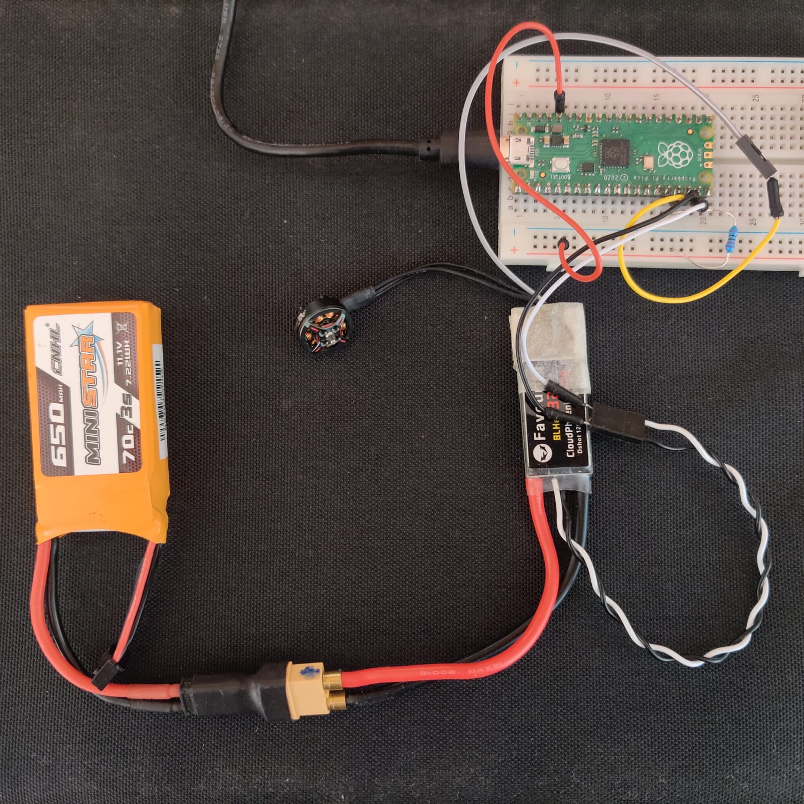
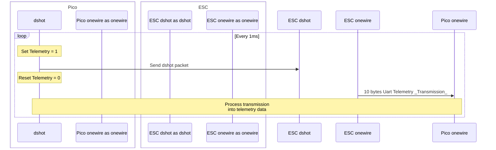

# Pico DShot



This repo is being developed to use a RPi Pico to send dshot commands to ESCs.

Normally, a flight controller sends commands to an ESC to control a motor.
In this repo, we are using a Rpi Pico as a stand in for the flight controller.
This is a work in progress.
This repo is being developed to be used as submodule for [pico-tts](https://github.com/Guppy16/pico-tts), which is a project to measure drone motor KPIs using a pico.

## Setting up the repo

```terminal
git clone git@github.com:Guppy16/pico-dshot.git
git submodule update --init
cd lib/extern/pico-sdk
git submodule update --init lib/tinyusb
```

Note in the last line, we intialise `TinyUSB`, because it is required to use the uart on the pico for serial read and write.

## Running the Unit Tests

We use [Unity Test](https://github.com/ThrowTheSwitch/Unity) as the framework for our tests.
Assuming all the submodules have been setup:

```terminal
mkdir test/build && cd $_
cmake ..
cmake --build .
ctest --verbose
```

---

## Examples

### Compile

Examples are provided in `example/`.
Below shows how the _simple_ example can be compiled (the others can be compiled similarily).
The _simple_ example can be used to check if the motor and ESC are connected correctly.

```terminal
mkdir examples/simple/build && cd $_
cmake ..
cmake --build .
```

### Pinout

The gpio pins can be configured in the examples in the corresponding `main.cpp` file. This is what has been assumed:

| pin | gpio | Pico Pad | ESC Pin                   |
| --- | ---- | -------- | ------------------------- |
|     | 13   | UART RX  | Onewire Uart TX Telemetry |
|     | 14   | PWM      | Dshot Signal              |
| 18  |      | GND      | ESC Signal GND            |

Note that the _GND_ pin can be any ground pint, but Pin 18 is used as it's closest to the ESC signal pin.

Separately, note that you may need to solder a wire on the ESC UART TX pad to connect to the pico. 

### Upload

Upload `dshot_example.uf2` to the pico, and open a serial connection to it.
Depending on your motor spec, it will automatically _arm_ (i.e ready to receive commands; not start spinning).
The serial monitor will print some configuration options, which can be used to verify that the Pico is behaving.
Ideally, the motor will beep when connected to a power source.

---

## Code Overview

- `include` header files to setup dshot variables and functions
  - `packet.h` module to compose a dshot packet from a dshot command
  - `dshot.h` configure pico hw (pwm, dma, rt) for dshot
  - `kissesctelem.h` functions to process onewire telem (crc8, buffer --> data)
  - `onewire.h` configure pico hw for onewire (uart, rt)
- `lib/extern/`
  - `pico-sdk/` pico sdk submodule
  - `Unity/` submodule for testing framework
- `examples/`
  - `simple/` most basic boilerplate to start sending dshot packets
  - `keyboard_control/` allows you to use serial input to send dshot commands
  - `dshot_led/` send dshot packets to builtin led to _see_ how the packets are sent
  - `onewire_telemetry/` setup esc to request telemetry data
- `test/` unit test `packet.h` and `kissesctelem.h`

Dependency Graph:

```terminal
|-- onewire
|   |-- kissesctelem
|   |-- dshot
|   |   |-- packet
```

## To Do

- [ ] Replace onewire telem with autotelemetry. Likely, the ESC can be reconfigured using some kind of passthrough. [Protocol discussion on Github issue](https://github.com/bitdump/BLHeli/issues/431). [GitHub issue with info on BlHel Suite](https://github.com/bitdump/BLHeli/issues/431).

## Backlog

- [ ] Attempt arm sequence according to BLHeli docs
- [ ] Currently dma writes to a PWM slice counter compare. This slice corresponds to two channels, hence dma may overwrite another channel. Is there a way to validate this? Can we use smth similar to `hw_write_masked()` (in `pwm.h`)?
- [ ] If composing a dshot pckt from cmd ever becomes the bottleneck, an alternative is to use a lookup table: address corresponds to 12 bit command (ignoring CRC), which maps to packets (an array of length 16, where each element is a 16 bit duty cycle). Memory usage: 2^12 address x (16 x 16 packet) = 2^20 bit word = 1 MB. This can be further compressed as the telemetry bit affects only the last two nibbles. Note: Pico flash = 2 MB.
- [ ] Test dshot performance using 125 MHz and 120 MHz mcu clk. May need to play around with `vco` using `lib/extern/pico-sdk/src/rp2_common/hardware_clocks/scripts/vcocalc.py` to find valid sys clock frequencies.
- [ ] Write unit tests that will work on the Pico. Write normal unit tests similar to [Example 2](https://github.com/ThrowTheSwitch/Unity/tree/b0032caca4402da692548f2ee296d3b1b1251ca0/examples/example_2).
- [ ] C code style and documentation according to [this](https://github.com/MaJerle/c-code-style) guide

---

## DShot Protocol

DShot is a digital protocol used to send commands from a flight controller to an ESC, in order to control a motor.
DShot has discretised resolution, where as PWM is analogue (on the FC side albeit discretised on the ESC due to hw limitations).
The digital protocal has advantages in accuracy, precision, resolution and communication.
Typically, dshot commands are sent over PWM hardware (note that we are _not_ controlling the motor using "pulse width modulation", but are rather piggy backing off of the PWM hardware to send dshot frames!).

A Dshot _frame_ is constructed as follows:

| _Value_  | _Telemetry_ | _Checksum_ |
| -------- | ----------- | ---------- |
| 11 bits  | 1 bit       | 4 bit      |
| 0 - 2047 | Boolean     | CRC        |

| Dshot Value | Meaning                                |
| ----------- | -------------------------------------- |
| 0           | Disarm, but hasn't been implemented    |
| 1 - 47      | Reserved for special use               |
| 48 - 2047   | Throttle position (resolution of 2000) |

Each bit is transmit as a high/low _duty cycle_ in a "__pulse__" using PWM hw:

| bit | duty cycle |
| --- | ---------- |
| 0   | \< 33%     |
| 1   | > 75%      |

The dshot frequency defines the _pulse period_:

$$
\text{pulse period} = \frac{1}{f_\text{dshot}}
$$

To indicate a frame reset, a pause of at least 2 μs is required between frames (source [Betaflight wiki](https://betaflight.com/docs/development/Dshot)). This pause can be represented as 0 duty cycles pulses:

$$
\text{Pause pulses (or bits)} = \lceil \frac{2 \mu \text{s}}{\text{Pulse Period}} \rceil
$$

| Dshot freq / kHz | pulse period / μs | Pause bits |
| ---------------- | ----------------- | ---------- |
| 150              | 6.67              | 1          |
| 600              | 1.67              | 2          |
| 1200             | 0.833             | 3          |

Our implementation uses a constant value of 4 bits as a pause between frames (i.e. we assume a max Dshot freq of 2000).
Hence, the PWM hw is sent a __packet__ of 20 pulses (16 for a DShot frame and 4 for a frame reset).
This is set in `packet.h::dshot_packet_length`.

### Example

To make the motors beep a DShot packet is constructed as follows:

The Dshot __command__ is: `Value = 1`, `Telemetry = 1`

→ First 12 bits of the _frame_: `Frame[0:12] = [Value|Telemetry] = 0x003`

→ The 4 bit crc is: `CRC = 0 XOR 0 XOR 3 = 3`

→ Concatonate `Frame[0:16] = [Value|Telemetry|CRC] = 0x0033`

→ Compose packet (with frame reset pulses at the end): `Packet = LLLL LLLL LLHH LLHH 0000`

The packet is transmit from left to right (i.e. big endian).

(Please note that most of this nomenclature is taken from the [betaflight dshot wiki](https://betaflight.com/docs/development/Dshot), but some of it may not be standard)

---

## Onewire Uart Telemetry

There are two overarching protocols that can be used to request telemetry data:

- uart (_onewire_ / _autotelemetry_)
- dshot (_bidirectional dshot_ / _extended dshot telemetry_)

These protocols are _not_ mutually exclusive. This section is about obtaining telemetry using _onewire_ uart telemetry. _Onewire_ sends a variety of data every 800 μs, whereas _bidirectional dshot_ just sends eRPM telemetry but every 80 μs (Dshot600). _Onewire_ is described in the [KISS ESC 32-bit series onewire telemetry protocol datasheet](./resources/KISS_telemetry_protocol.pdf). The process looks like this:



1. Pico: send dshot packet with `Telemetry = 1`. Reset telemetry immediately.
2. ESC: receive dshot packet; send a _transmission_ over _onewire_ uart telemetry to Pico.
3. Pico: receive the _transmission_, check its CRC8 and then convert the _transmission_ to _telemetry data_.

### _Onewire Transmission_

Each _transmission_ is transferred over UART at:

- `115200 baudrate`
- `3.6 V` (Use a `1k` resistor pull-up to `2.5 - 5 V` to remove noise)
- `10 bytes`:

| Byte(s) | Value           | Resolution |
| :-----: | --------------- | ---------- |
|    0    | Temperature     | 1 C        |
| 1 \| 2  | (centi) Voltage | 10 mV      |
| 3 \| 4  | (centi) Current | 10 mA      |
| 5 \| 6  | Consumption     | 1 mAh      |
| 7 \| 8  | Electrical rpm  | 100 erpm   |
|    9    | 8-bit CRC       |

To convert erpm to rpm:

$$
\text{rpm} = \frac{\text{erpm}}{\text{\\# Magnet pole} \times 2}
$$

---

## Sources

### Docs and Sample Implementation

- [Pico SDK API Docs](https://raspberrypi.github.io/pico-sdk-doxygen/modules.html). Some quick links: [dma](https://raspberrypi.github.io/pico-sdk-doxygen/group__hardware__dma)
- [Documentation on the Pico](https://www.raspberrypi.com/documentation/microcontrollers/?version=E0C9125B0D9B) incl spec, datasheets, [pinout](https://datasheets.raspberrypi.com/pico/Pico-R3-A4-Pinout.pdf), etc.
- [Pico examples](https://github.com/raspberrypi/pico-examples) from the rpi github incl `dma/`. There's an interesting example on pairing an adc with dma [here](https://github.com/raspberrypi/pico-examples/blob/master/adc/dma_capture/dma_capture.c). Note that when viewing pico examples, they use `#include "pico/stdlib.h"`. This is _not_ to be used in the _Arduino_ framework! as explained in [this post](https://community.platformio.org/t/include-pico-stdlib-h-causes-errors/22997).
- [Unity Assertion Reference](https://github.com/ThrowTheSwitch/Unity/blob/master/docs/UnityAssertionsReference.md) is a useful guide handbook for unit testing with Unity framework.
- [Unit testing on Embedded Target using PlatformIO](https://piolabs.com/blog/insights/unit-testing-part-2.html)
- CMake file for Unity Testing was inspired from [Rainer Poisel](https://www.poisel.info/posts/2019-07-15-cmake-unity-integration/), [Throw The Switch](http://www.throwtheswitch.org/build/cmake) and [Testing with CMake and CTest](https://cmake.org/cmake/help/book/mastering-cmake/chapter/Testing%20With%20CMake%20and%20CTest.html).
- Diagrams using [Mermaid.js](http://mermaid.js.org/)

### Explanations of DShot

- [Betaflight DShot Wiki](https://betaflight.com/docs/development/Dshot)
- [Spencer's HW Blog](https://www.swallenhardware.io/battlebots/2019/4/20/a-developers-guide-to-dshot-escs) has a quick overview on the DShot protocol, list of the dshot command codes (which shd be sourced somewhere in the [betaflight repo](https://github.com/betaflight/betaflight)), and implmenetation overviews using scp and dma.
- [This post](https://blck.mn/2016/11/dshot-the-new-kid-on-the-block/) has a simple explanation of dshot with a few examples
- [DShot - the missing handbook](https://brushlesswhoop.com/dshot-and-bidirectional-dshot/) has supported hw, dshot frame example, arming, telemetry, bi-directional dshot
- [BLHeli dshot special command spec](https://github.com/bitdump/BLHeli/blob/master/BLHeli_32%20ARM/BLHeli_32%20Firmware%20specs/Digital_Cmd_Spec.txt)
- [Missing Handbook](https://brushlesswhoop.com/dshot-and-bidirectional-dshot/#special-commands) also has a good explanation of commands
[Original RC Groups post on dshot](https://www.rcgroups.com/forums/showthread.php?2756129-Dshot-testing-a-new-digital-parallel-ESC-throttle-signal)
- [SiieeFPV](https://www.youtube.com/watch?v=fNLxHWd0Bvg) has a YT vid explaining DMA implementation on a _Kinetis K66_. This vid was a useful in understanding what was needed for our implementation.
- KISS ESC onewire telemetry protocol [pdf](https://www.google.co.uk/url?sa=t&rct=j&q=&esrc=s&source=web&cd=&ved=2ahUKEwic6OitkJ3-AhXJUMAKHaL6DiEQFnoECAoQAQ&url=https%3A%2F%2Fwww.rcgroups.com%2Fforums%2Fshowatt.php%3Fattachmentid%3D8524039%26d%3D1450424877&usg=AOvVaw1FWow1ljvZue1ImISgzlca)
- CRC8 algorithm [explanation website](http://www.sunshine2k.de/articles/coding/crc/understanding_crc.html#ch4)


### Other

- Use [Zadig](https://zadig.akeo.ie/) to install drivers for the RPi boot interface on Windows. This makes the flashing experience a LOT better! This has been mentioned in platform io and github forums (in depth [here](https://community.platformio.org/t/official-platformio-arduino-ide-support-for-the-raspberry-pi-pico-is-now-available/20792/9), briefly [here](https://community.platformio.org/t/raspberry-pi-pico-upload-problem/22809/7), which links to [this](https://github.com/platformio/platform-raspberrypi/issues/2#issuecomment-828586398)).
- [Wiz IO Pico](https://github.com/Wiz-IO/wizio-pico): seems like an alternative to the Arduino framework used in PlatformIO? More details can be found on their [Baremetal wiki](https://github.com/Wiz-IO/wizio-pico/wiki/BAREMETAL)
- [Rpi Pico Forum post](https://forums.raspberrypi.com/viewtopic.php?t=332483). This person has balls to try and implemenet dshot using assembly!!
- List of [Arduino libraries for the RP2040](https://www.arduinolibraries.info/architectures/rp2040). I've not used any yet
- Interesting post on [processing serial without blocking](http://www.gammon.com.au/serial)
- [Upload port required issue](https://github.com/platformio/platform-raspberrypi/issues/2). I don't think this issue will be faced if using Zadig
- [BLHeli 32 Manual](https://github.com/bitdump/BLHeli/blob/master/BLHeli_32%20ARM/BLHeli_32%20manual%20ARM%20Rev32.x.pdf)
- In the future, this repo may want to use [GitHub hosted runners](https://docs.github.com/en/actions/using-github-hosted-runners/about-github-hosted-runners) to create [GitHub Packages](https://docs.github.com/en/packages/learn-github-packages/introduction-to-github-packages). This may require some knowledge on setting up [GitHub Actions](https://docs.github.com/en/actions/quickstart#creating-your-first-workflow), as well as the [Workflow syntax](https://docs.github.com/en/actions/using-workflows/workflow-syntax-for-github-actions)
- A [thread on the rpi forum](https://forums.raspberrypi.com/viewtopic.php?p=2091821#p2091821) about inspecting the contents of the alarm pool for logging
- A [blog post](http://reefwingrobotics.blogspot.com/2020/05/arduino-esc-tester-adding-dshot.html) with a dshot implementation using SPI with an Arduino Uno

NOTE: (Although we don't use this functionality), a common implmentation measuring timer uses 32 bit time (note that 64 bit is possible using `timer_hw->timerawl` but more effort..)

- `timer_hw->timerawl` returns a 32 bit number representing the number of microseconds since power on
- This will overflow at around 72 hrs, so must assume that this longer than the operation timer of the pico
- This has been the cause of many accidental failures in the past :)

### Bidirectional DShot

- [DShot - the missing handbook](https://brushlesswhoop.com/dshot-and-bidirectional-dshot/) also talks about bi-directional dshot
- [RPi Pico Forum thread on Evaluating PWM signal](https://forums.raspberrypi.com/viewtopic.php?t=308269). This could be useful for bidirectional dshot
- [Pico Example to measure duty cycle](https://github.com/raspberrypi/pico-examples/blob/master/pwm/measure_duty_cycle/measure_duty_cycle.c)
- [Interesting PR on the first implementation of bidir dshot](https://github.com/betaflight/betaflight/pull/7264). This discussion alludes to the _politics_ of the protocol
- Note that we need to check the FW version on the ESC to see if it supports bidir (and EDT). [BLHeli Passthrough](https://github.com/BrushlessPower/BlHeli-Passthrough) is implemented as an Arduino Lib for ESP32 and some Arduinos. A good exercise would be to add support for the Pico. [This](https://github.com/betaflight/betaflight/blob/master/src/main/drivers/serial_escserial.c#L943) may be a betaflight implementation of passthrough, but I couldn't understand it. [BLHeli Suite](https://github.com/bitdump/BLHeli) is also needed.
- Researching this topic, I came across DMA "burst" mode, which apparently helps in transitioning from send to receive. Not sure, but maybe a starting point can be achieved from [this post](http://forum.chibios.org/viewtopic.php?t=5677)
- [Chained DMA](https://vanhunteradams.com/Pico/DAC/DMA_DAC.html) may be useful to switch from write to read configuration
